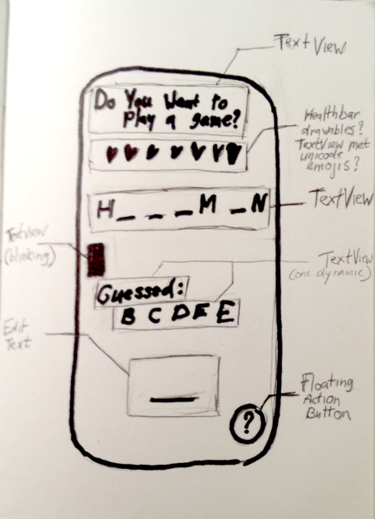
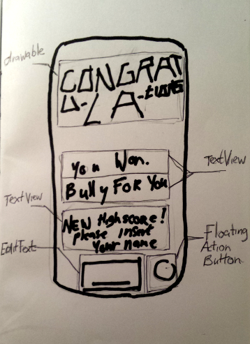
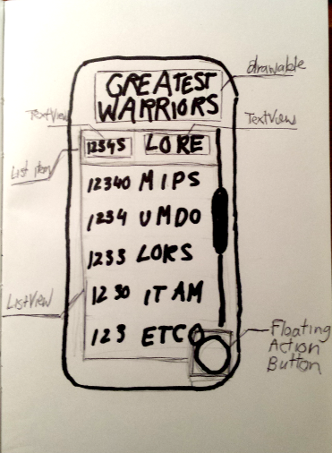
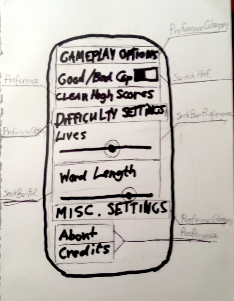
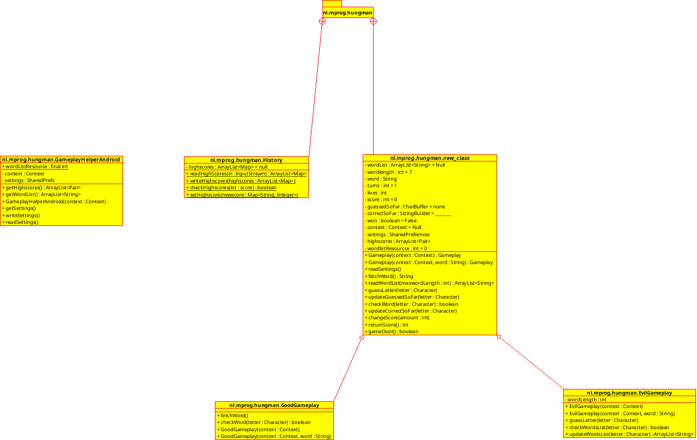

#Design Document

This is the Design Document for the Hungman app for [Native App Studio](http://apps.mprog.nl)

##Index
+ Activity Sketches
+ Model class diagram
+ Style Guide & Code Practices
+ API/Helpers/Handlers

##Activity Sketches

## Model class diagram

Our app will contain at least four model classes whose hierachy will look something like this:

For the original UML file see [here](design/classdiagram.xmi).

##Style Guide & Code Practices

All of our app will be written in Java, by which we will be adherring to the 
[Google Java Styleguide](https://google.github.io/styleguide/javaguide.html) unless otherwise specified.

For our project structure and coding practices we'll try to follow 
[futurice's "Best Practices"](https://github.com/futurice/android-best-practices) as closely as possible,
without going against what we've learned for Native App Studio, breaking compatability, or creating unnecessary extra work.

##API/Helpers/Handlers

+ We will need to work with at least an XML parser to get the wordlist out of word.xml.
  This will most likely end up to be either [XmlPullParser](https://developer.android.com/reference/org/xmlpull/v1/XmlPullParser.html) or [SAXParser](https://developer.android.com/reference/javax/xml/parsers/SAXParser.html) depending on results and ease of use.

+ On top of that we will either need a CSV Parser or SQL Handlers to write and read Highscores. If we choose to use a CSV file we can probably write a parser ourselves.

+ Then finally, to view the highscores to the user, we might need a custom Adapter if it turns out the Default Adapter doesn't suffice.

- - -

Joost Bremmer < [toost.b@gmail.com](mailto:toost.b@gmail.com) >